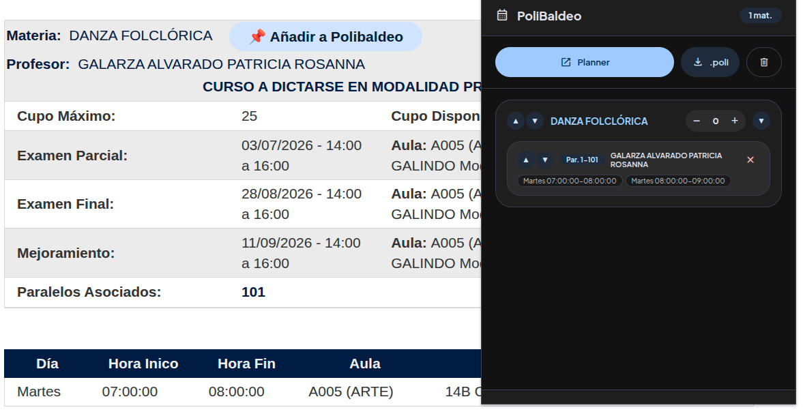
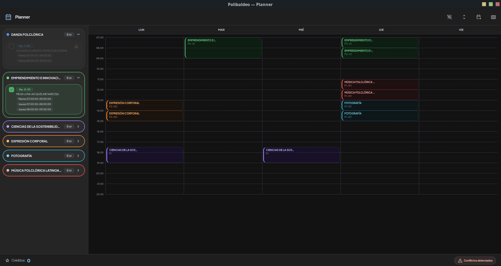

# PoliBaldeo - Aplicación de Gestión de Horarios
<p align="center">
  
</p>

Una aplicación hecha en Python para gestionar horarios académicos con detección de conflictos y funciones de exportación a calendario.

## 💻 Instalación

La aplicación está disponible para Windows, macOS y Linux. No se requiere instalación manual.

1.  Ve a la sección de **[Releases](https://github.com/Winareku/PoliBaldeo/releases)** del repositorio en GitHub.
2.  Descarga el archivo correspondiente a tu sistema operativo.
3.  Ejecuta la aplicación directamente.

Si prefieres instalar desde el código fuente, sigue los pasos en la sección "Creación de un Ejecutable Independiente".

## 🚀 Características

-   **Gestión de Cursos**: Añade, edita y elimina materias y sus paralelos.
-   **Detección de Conflictos de Horario**: Detección automática de conflictos de tiempo entre los paralelos.
-   **Vista de Calendario**: Visualización del horario semanal.
-   **Capacidades de Exportación**:
    -   Guarda/carga horarios en formato `.poli`.
    -   Exporta a formato iCalendar (`.ics`).
    -   Guarda la vista de calendario como PNG o PDF.
-   **Generador de Combinaciones**: Genera automáticamente combinaciones de horarios sin conflictos.
-   **Soporte de Temas**: Temas de interfaz de usuario personalizables, con un tema oscuro por defecto.
-   **Arrastrar y Soltar (Drag & Drop)**: Soporte para abrir archivos arrastrándolos a la aplicación.
-   **Seguimiento de Créditos**: Cálculo automático del total de créditos.

## 📖 Uso

### Flujo de Trabajo Básico

1.  **Iniciar la Aplicación**: Ejecuta el archivo descargado.
2.  **Crear/Abrir Horario**:
    -   Usa `Archivo → Nuevo` para un nuevo horario.
    -   Usa `Archivo → Abrir` o arrastra un archivo `.poli` para cargar un horario existente.
3.  **Añadir Materias**:
    -   `Editar → Añadir Materia`.
    -   Introduce el nombre de la materia y los créditos.
4.  **Añadir Paralelos**:
    -   Haz clic en el icono de la carpeta junto a una materia.
    -   Añade los bloques de tiempo para el paralelo.
5.  **Seleccionar Paralelos**:
    -   Marca las casillas para seleccionar los paralelos.
    -   Los paralelos en conflicto se desactivan automáticamente.
6.  **Ver Calendario**: `Ver → Vista de Horario`.
7.  **Exportar**:
    -   `Archivo → Guardar/Guardar Como` para el formato `.poli`.
    -   `Archivo → Exportar Calendario` para el formato `.ics`.

### Funciones Avanzadas

#### Generación Automática de Combinaciones
-   `Editar → Generar Combinación`.
-   Encuentra automáticamente combinaciones de horarios sin conflictos.
-   Selecciona entre las opciones disponibles.

#### Personalización de Temas
-   `Ver → Tema → Seleccionar tema`.
-   Añade archivos `.qss` personalizados a la carpeta `themes/`.

#### Diseño de Múltiples Columnas
-   `Ver → Columnas → Seleccionar 1-4 columnas`.
-   Útil para organizar muchas materias.

## 📁 Estructura del Proyecto

```
PoliBaldeo/
│
├── main.py                 # Punto de entrada principal
├── config.py               # Configuración y constantes
├── requirements.txt        # Dependencias de Python
├── README.md               # Este archivo
│
├── dialogs/                # Módulo de ventanas de diálogo
│   ├── __init__.py
│   ├── add_materia_dialog.py
│   ├── add_paralelo_dialog.py
│   ├── info_paralelo_dialog.py
│   └── combinacion_dialog.py
│
├── utils/                  # Módulo de utilidades
│   ├── __init__.py
│   ├── file_handler.py       # Operaciones de E/S de archivos
│   ├── calendar_exporter.py  # Exportación a iCalendar
│   ├── theme_manager.py      # Gestión de temas
│   └── time_utils.py         # Utilidades relacionadas con el tiempo
│
├── widgets/                # Componentes de widgets personalizados
│   ├── __init__.py
│   ├── materia_widget.py     # Widget de materia
│   └── paralelo_widget.py    # Widget de paralelo
│
├── windows/                # Ventanas de la aplicación
│   ├── __init__.py
│   ├── main_window.py        # Ventana principal de la aplicación
│   └── calendario_window.py  # Ventana de vista de calendario
│
├── resources/              # Recursos de la aplicación
│   ├── PoliBaldeo.png        # Icono de la aplicación
│   └── download.png          # Icono de arrastrar y soltar
│
└── themes/                 # Temas de la interfaz de usuario
    └── Dark.qss            # Tema oscuro por defecto
```

## 🏗️ Documentación de Módulos

### config.py
Archivo de configuración central que contiene:
-   Rutas de archivos y extensiones.
-   Constantes y dimensiones de la interfaz de usuario.
-   Hojas de estilo por defecto.
-   Parámetros académicos (créditos, semanas, etc.).

### utils/
**file_handler.py**: Gestiona las operaciones con archivos `.poli`.
-   `save_to_file()`: Guarda el horario en un archivo.
-   `load_from_file()`: Carga el horario desde un archivo.
-   `validate_filepath()`: Asegura la extensión de archivo correcta.

**calendar_exporter.py**: Maneja la exportación a iCalendar.
-   `export_to_ics()`: Exporta el horario a formato `.ics`.

**theme_manager.py**: Sistema de gestión de temas.
-   `load_available_themes()`: Descubre los temas disponibles.
-   `apply_theme()`: Aplica el tema seleccionado.
-   `apply_default_theme()`: Aplica el tema por defecto.

**time_utils.py**: Utilidades relacionadas con el tiempo.
-   `hora_a_minutos()`: Convierte la hora a minutos.
-   `hay_conflicto_horario()`: Comprueba si hay conflictos de horario.
-   `generar_color_oscuro()`: Genera colores oscuros aleatorios.

### dialogs/
Contiene todas las ventanas de diálogo:
-   **AddMateriaDialog**: Añadir/editar materias.
-   **AddParaleloDialog**: Añadir/editar paralelos.
-   **InfoParaleloDialog**: Muestra información del paralelo.
-   **CombinacionDialog**: Selecciona combinaciones de horarios.

### widgets/
Componentes de widgets personalizados:
-   **MateriaWidget**: Visualización y gestión de materias.
-   **ParaleloWidget**: Visualización y selección de paralelos.

### windows/
Ventanas principales de la aplicación:
-   **PoliBaldeo**: Ventana principal de la aplicación.
-   **CalendarioWindow**: Ventana de vista de calendario semanal.

## 🎨 Creación de Temas Personalizados

1.  Crea un nuevo archivo `.qss` en la carpeta `themes/`.
2.  Define los estilos usando la sintaxis de Qt Style Sheets.
3.  Reinicia la aplicación o selecciona el tema desde el menú `Ver → Tema`.

Ejemplo de la estructura de un tema:
```css
QMainWindow {
    background-color: #2b2b2b;
    color: #ffffff;
}

QPushButton {
    background-color: #3b3b3b;
    border: 1px solid #5c6e91;
    border-radius: 3px;
}
```

## 📦 Creación de un Ejecutable Independiente (desde el código fuente)

Para crear un ejecutable independiente:

1.  Instala los prerrequisitos:
    -   Python 3.8 o superior.
    -   pip (instalador de paquetes de Python).

2.  Clona el repositorio:
    ```bash
    git clone https://github.com/yourusername/PoliBaldeo.git
    cd PoliBaldeo
    ```

3.  Instala las dependencias:
    ```bash
    pip install -r requirements.txt
    pip install pyinstaller
    ```

4.  Construye el ejecutable:
    ```bash
    pyinstaller --onefile --windowed --icon=resources/PoliBaldeo.png main.py
    ```

El ejecutable se creará en la carpeta `dist/`.

## 🤝 Contribuciones

1.  Haz un fork del repositorio.
2.  Crea una rama para tu nueva función (`git checkout -b feature/AmazingFeature`).
3.  Confirma tus cambios (`git commit -m 'Add some AmazingFeature'`).
4.  Sube la rama (`git push origin feature/AmazingFeature`).
5.  Abre un Pull Request.

## 📝 Licencia

Este proyecto está bajo la Licencia MIT - consulta el archivo `LICENSE` para más detalles.

## 🐛 Problemas Conocidos

-   La exportación del calendario asume un semestre de 16 semanas.
-   Los bloques de tiempo están limitados de 7:00 AM a 10:00 PM.
-   Se omiten los fines de semana.

## 📮 Soporte

Para problemas, preguntas o sugerencias, por favor abre un "issue" en GitHub o contactame por Discord `winareku`.

<p align="center">
  
</p>

<p align="center">
  
</p>
