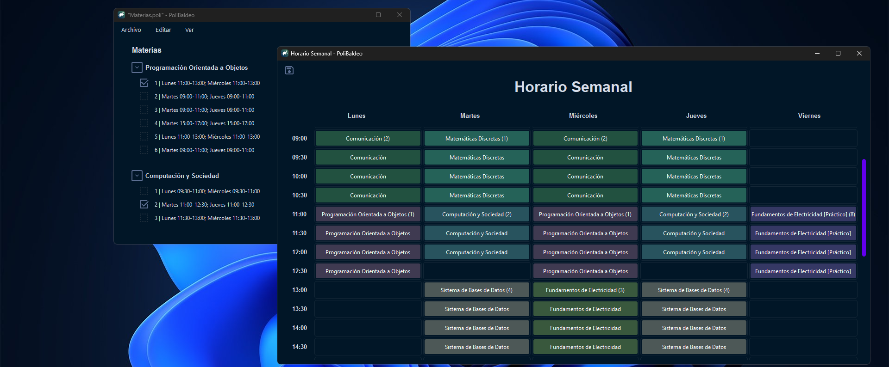

# PoliBaldeo

  

### 📒 PoliBaldeo es una app de escritorio que agiliza el proceso de matriculación en ESPOL. Permite organizar materias, paralelos y detectar conflictos de horario en una interfaz simple, ayudando a planificar el registro de forma rápida y eficiente.
## 🔹 Funciones principales:
- Añadir materias y paralelos con horarios personalizados.
- Verificación automática de conflictos de horario.
- Visualización clara en formato de horario semanal.
- Interfaz simple, rápida y sin necesidad de conexión a internet.

## 🔸 Uso:
- Ejecuta el archivo PoliBaldeo.exe (no requiere instalación).

### 💡 Desarrollado en Python con PySide6.

  

