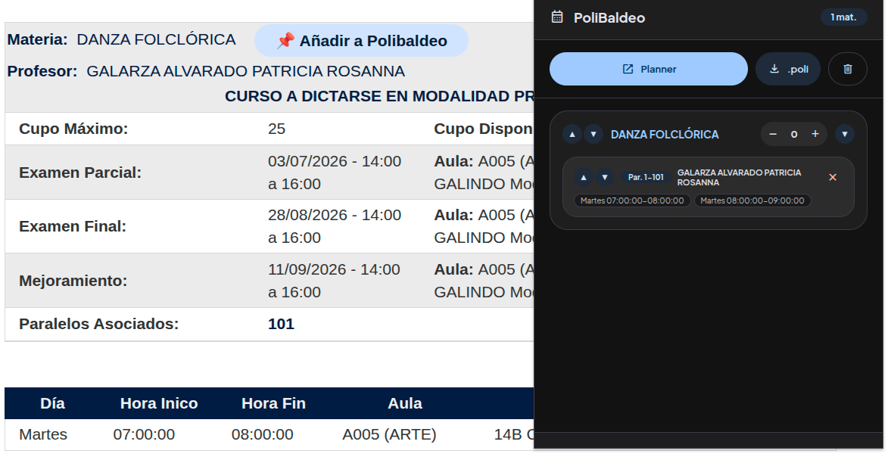
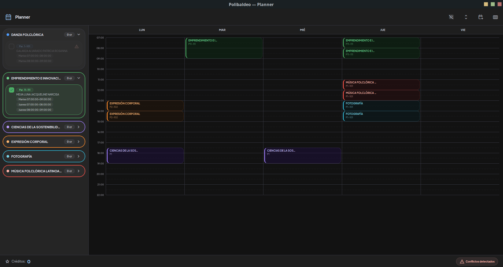

# PoliBaldeo - Planificación de Horarios

<p align="center">
  
</p>

**PoliBaldeo** es una extensión de Chrome diseñada para simplificar el proceso de matriculación de los estudiantes de la **ESPOL**. Permite capturar la oferta académica directamente desde el portal universitario y organizar horarios sin conflictos de forma visual y eficiente.

## 🚀 Características Principales

  - **Captura Inteligente**: Inyecta un botón "Añadir" y un navegador de paralelos directamente en el portal académico. Extrae horarios, profesor, ubicación y exámenes (parcial, final y mejoramiento) con un solo clic.
  - **Navegador de paralelos**: Menú de navegación entre paralelos de una misma materia estilo Material 3, ubicado debajo del título de la página.
  - **Planificador Visual (Planner)**: Interfaz dedicada con una rejilla semanal para visualizar la carga académica. Incluye una vista alternativa para mostrar únicamente los exámenes parciales.
  - **Detección de Conflictos**: Sistema automático que identifica y resalta cruces de horarios entre paralelos seleccionados, incluyendo conflictos entre exámenes. Muestra las materias conflictivas al pasar el ratón sobre el icono de advertencia.
  - **Auto‑selección inteligente**: Botón "dado" que busca automáticamente una combinación de paralelos sin conflictos mediante backtracking aleatorio.
  - **Zero-Backend**: Los datos se gestionan localmente en el navegador mediante `chrome.storage.local`, garantizando privacidad y rapidez.
  - **Exportación Versátil**:
      - Genera archivos `.poli` en formato JSON para respaldo y transferencia.
      - Exporta a formato iCalendar (`.ics`) para sincronizar con Google Calendar, Outlook o Apple Calendar.
      - Captura la vista del horario como imagen PNG, lista para compartir.
  - **Interfaz Material 3 Dark**: Diseño oscuro moderno con paleta de colores consistente, toasts unificados y modales dinámicos.
  - **Toasts unificados**: Notificaciones visuales con botón de cierre y opción de deshacer.
  - **Colores por materia**: Cada materia tiene un color distintivo en el popup y el planner, siguiendo una paleta armonizada.

## 🛠️ Instalación (Modo Desarrollador)

Actualmente, la extensión se puede instalar cargando el código fuente directamente en Chrome:

1.  Descarga o clona este repositorio:
    ```bash
    git clone https://github.com/Winareku/PoliBaldeo.git
    ```
2.  Abre tu navegador y ve a `chrome://extensions/`.
3.  Activa el **"Modo de desarrollador"** en la esquina superior derecha.
4.  Haz clic en el botón **"Cargar extensión sin empaquetar"**.
5.  Selecciona la carpeta raíz del proyecto.

## 📂 Arquitectura del Proyecto

La extensión utiliza una arquitectura modular de scripts compartidos (Vanilla JS) sin dependencias externas (sin Webpack, React o jQuery), optimizada para el **Manifest V3**.

### Estructura de Archivos:

  - `shared/`: Lógica persistente y utilitarios puros (almacenamiento, exportadores, constantes).
    - `styles/`: Hojas de estilo modulares (variables, base, botones, modal, componentes compartidos).
    - `components/`: Componentes UI reutilizables (modal dinámico).
    - `libs/`: Librerías de terceros (html-to-image para captura de imagen).
  - `content/`: Scripts inyectados en el portal académico para scraping y navegación de paralelos.
  - `planner/`: Interfaz y lógica del planificador de horarios, dividida en módulos (conflictos, grilla, UI y orquestador).
  - `popup/`: Menú rápido de la extensión, con módulos separados para estado, toasts, modales, tarjetas, drag & drop y orquestador.

### Orden de Carga Crítico:

Para garantizar la disponibilidad de variables globales, los scripts siguen este orden estricto:

**Popup:**
1. `utils.js` (Constantes)
2. `storage.js` (Capa de persistencia)
3. `exporter.js` (Lógica de archivos)
4. `modal.js` (Componente de modales)
5. `popup-state.js` (Estado global)
6. `popup-toasts.js` (Sistema de notificaciones)
7. `popup-modals.js` (Diálogos modales)
8. `popup-cards.js` (Renderizado de tarjetas)
9. `popup-drag.js` (Drag & drop)
10. `popup.js` (Orquestador y listeners)

**Planner:**
1. `utils.js` (Constantes)
2. `storage.js` (Capa de persistencia)
3. `ics-exporter.js` (Lógica de archivos)
4. `modal.js` (Componente de modales)
5. `html-to-image.min.js` (Captura de imagen)
6. `planner-conflicts.js` (Lógica de conflictos)
7. `planner-grid.js` (Renderizado de grilla)
8. `planner-ui.js` (Estado y panel izquierdo)
9. `planner.js` (Orquestador y listeners)

## 🤝 Contribuciones

1.  Haz un fork del repositorio.
2.  Crea una rama para tu mejora (`git checkout -b feature/Mejora`).
3.  Realiza tus cambios y haz commit (`git commit -m 'Añade una mejora'`).
4.  Sube la rama (`git push origin feature/Mejora`).
5.  Abre un Pull Request.

## 📝 Licencia

Este proyecto está bajo la Licencia MIT - consulta el archivo `LICENSE` para más detalles.

## 🎨 Attributions

Este proyecto utiliza los siguientes recursos de terceros, cuyas licencias son compatibles con la licencia MIT del proyecto:

- **Plus Jakarta Sans** – Fuente tipográfica  
  Copyright 2020 The Plus Jakarta Sans Project Authors.  
  Licencia: [SIL Open Font License 1.1](https://scripts.sil.org/OFL)

- **Material Symbols** – Íconos  
  Copyright Google Inc.  
  Licencia: [Apache License 2.0](https://www.apache.org/licenses/LICENSE-2.0)

- **html-to-image** – Captura de DOM a imagen PNG  
  Copyright (c) 2023 bubkoo  
  Licencia: [MIT License](https://github.com/bubkoo/html-to-image/blob/main/LICENSE)

## 📮 Soporte

Si encuentras algún error en el raspado de datos o tienes sugerencias para el planificador, por favor abre un "issue" en el repositorio de GitHub.

## 📷 Screenshots

<p align="center">
  
</p>

<p align="center">
  
</p>