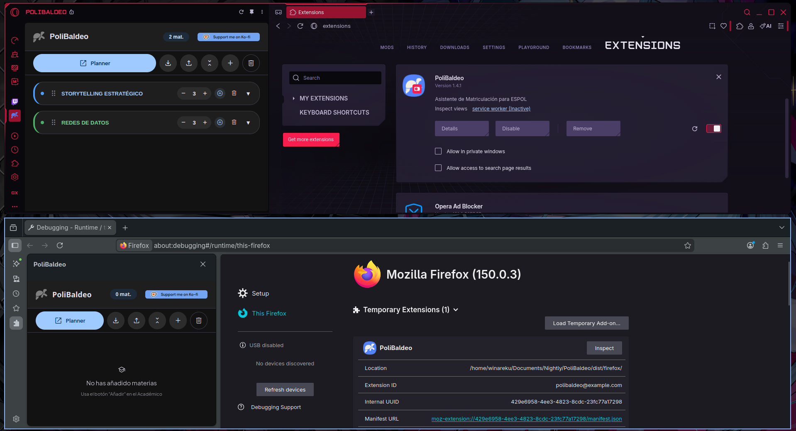

# PoliBaldeo - Planificación de Horarios

<p align="center">
  
</p>

**PoliBaldeo** es una extensión de código abierto diseñada para simplificar el proceso de matriculación de los estudiantes de la **ESPOL**. Permite capturar la oferta académica directamente desde el portal universitario y organizar horarios sin conflictos de forma visual y eficiente.

---

### ✨ ¡Novedades Multi-Plataforma!

¡PoliBaldeo ya no es solo para Chrome! Hemos rediseñado la arquitectura para ofrecer soporte profesional en múltiples navegadores:

- **Chrome & Edge**: Integración total con el nuevo **Side Panel** de Chrome.
- **Opera**: Soporte dedicado para la barra lateral y ventanas emergentes.
- **Firefox**: Versión optimizada con integración en la barra lateral (Sidebar Action).

<p align="center">
  
</p>

---


## 🚀 Características Principales

  - **Captura Inteligente**: Inyecta un **botón split** (con menú desplegable) y un navegador de paralelos directamente en el portal académico. El botón principal añade o actualiza el paralelo actual (teórico + práctico activo). El menú desplegable incluye la opción **“Añadir todo”**, que captura **todas las combinaciones de paralelos prácticos** asociados al teórico en un solo paso, sin recargar la página, extrayendo horarios, profesor, ubicación y exámenes (parcial, final y mejoramiento) de cada uno.
  - **Captura masiva de prácticos**: Con un solo clic en el menú desplegable, añade todas las combinaciones teórico‑práctico de la materia actual, ahorrando tiempo al usuario.
  - **Navegador de paralelos**: Menú de navegación entre paralelos de una misma materia estilo Material 3, ubicado debajo del título de la página.
  - **Planificador Visual (Planner)**: Interfaz dedicada con una rejilla semanal para visualizar la carga académica. Incluye una vista alternativa para mostrar únicamente los exámenes parciales.
  - **Detección de Conflictos**: Sistema automático que identifica y resalta cruces de horarios entre paralelos seleccionados, incluyendo conflictos entre exámenes. Muestra las materias conflictivas al pasar el ratón sobre el icono de advertencia.
  - **Auto‑selección inteligente**: Botón "dado" que busca automáticamente una combinación de paralelos sin conflictos mediante backtracking aleatorio, notificando el resultado con elegantes toasts.
  - **Persistencia y sincronización**: La selección del planner se guarda automáticamente y se restaura al reabrir. Los cambios realizados en el popup se reflejan al instante en el planner, y viceversa. Los colores de las materias se mantienen coherentes en toda la extensión.
  - **Zero-Backend**: Los datos se gestionan localmente en el navegador mediante `chrome.storage.local`, garantizando privacidad y rapidez.
  - **Exportación Versátil**:
      - Genera archivos `.poli` en formato JSON para respaldo y transferencia.
      - Exporta a formato iCalendar (`.ics`) para sincronizar con Google Calendar, Outlook o Apple Calendar.
      - Captura la vista del horario como imagen PNG, lista para compartir.
  - **Interfaz Material 3 Dark**: Diseño oscuro moderno con paleta de colores consistente, toasts unificados y modales dinámicos.
  - **Toasts unificados**: Notificaciones visuales con botón de cierre y opción de deshacer, presentes tanto en el popup como en el planner.
  - **Colores por materia**: Cada materia tiene un color distintivo en el popup y el planner, siguiendo una paleta armonizada que se conserva incluso al renombrar materias.

## 🛠️ Instalación

### Opción 1: Instalar desde la Chrome Web Store (recomendada)

Puedes instalar PoliBaldeo directamente desde la Chrome Web Store:

[](https://chromewebstore.google.com/detail/polpjnkemhjlmadehenohmpjgnmjonpb?utm_source=item-share-cb)

Haz clic en el enlace y pulsa "Añadir a Chrome".

### Opción 2: Instalación manual (modo desarrollador)

Si prefieres cargar la extensión desde el código fuente o probar las versiones de otros navegadores:

1.  Descarga o clona este repositorio:
    ```bash
    git clone https://github.com/Winareku/PoliBaldeo.git
    ```
2.  Prepara el manifiesto para tu navegador (ver sección [Compilación](#-compilación-y-builds)). Por defecto, la carpeta `src/` ya incluye un `manifest.json` para Chrome.
3.  Abre tu navegador y ve a la página de extensiones:
    - **Chrome/Edge**: `chrome://extensions/`
    - **Opera**: `opera://extensions/`
    - **Firefox**: `about:debugging#/runtime/this-observation`
4.  Activa el **"Modo de desarrollador"**.
5.  Carga la extensión:
    - En Chrome/Opera: Haz clic en **"Cargar extensión sin empaquetar"** y selecciona la carpeta **`src`**.
    - En Firefox: Haz clic en **"Cargar complemento temporal"** y selecciona cualquier archivo dentro de la carpeta **`src`**.

**Importante:** La carpeta que debes seleccionar es siempre `src`, no la carpeta raíz del repositorio.


## 📂 Arquitectura del Proyecto

La extensión utiliza una arquitectura modular de scripts compartidos (Vanilla JS) sin dependencias externas (sin Webpack, React o jQuery), optimizada para el **Manifest V3**.

### Estructura de Archivos:

- `src/`: Carpeta raíz de la extensión.
  - `background/`: Service workers específicos por plataforma (`chromium.js`, `opera.js`, `firefox.js`).
  - `manifests/`: Manifiestos maestros para cada navegador.
  - `shared/`: Lógica persistente y utilitarios puros (almacenamiento, exportadores, constantes).
    - `styles/`: Hojas de estilo modulares (variables, base, botones, modal, componentes compartidos).
    - `components/`: Componentes UI reutilizables (modal dinámico).
  - `content/`: Scripts de inyección para el portal académico.
  - `ui/`: Interfaz principal (Side Panel).
    - `planner/`: Interfaz y lógica del planificador de horarios.
- `scripts/`: Herramientas de automatización en Python para builds y releases.
- `manifests/`: Copias de respaldo de los manifiestos base.


### Orden de Carga Crítico:

Para garantizar la disponibilidad de variables globales, los scripts siguen este orden estricto:

**Interfaz Principal (Side Panel):**
1. `utils.js` (Constantes)
2. `storage.js` (Capa de persistencia)
3. `exporter.js` (Lógica de archivos)
4. `modal.js` (Componente de modales)
5. `state.js` (Estado global UI)
6. `toasts.js` (Sistema de notificaciones)
7. `modals.js` (Diálogos modales)
8. `cards.js` (Renderizado de tarjetas)
9. `drag.js` (Drag & drop)
10. `ui.js` (Orquestador y listeners)


**Planner:**
1. `utils.js` (Constantes)
2. `storage.js` (Capa de persistencia)
3. `ics-exporter.js` (Lógica de archivos)
4. `modal.js` (Componente de modales)
5. `html-to-image.min.js` (Captura de imagen)
6. `planner-conflicts.js` (Lógica de conflictos)
7. `planner-grid.js` (Renderizado de grilla)
8. `planner-ui.js` (Estado y panel izquierdo)
9. `planner.js` (Orquestador y listeners)

## 📦 Compilación y Builds

PoliBaldeo incluye un sistema de automatización basado en Python para generar versiones específicas de cada navegador en la carpeta `dist/`.

### Generar Builds
Para crear las carpetas de desarrollo de cada plataforma:
```bash
python scripts/build.py
```

### Generar Release (ZIPs)
Para generar los paquetes `.zip` listos para subir a las tiendas:
```bash
python scripts/release.py
```

Esto generará una carpeta `dist/` con subcarpetas y archivos `.zip` para **Chromium**, **Firefox** y **Opera**.


## 🤝 Contribuciones

1.  Haz un fork del repositorio.
2.  Crea una rama para tu mejora (`git checkout -b feature/Mejora`).
3.  Realiza tus cambios y haz commit (`git commit -m 'Añade una mejora'`).
4.  Sube la rama (`git push origin feature/Mejora`).
5.  Abre un Pull Request.

## ☕ Donaciones

Si PoliBaldeo te ha ayudado a sobrevivir a la semana de matriculación, puedes apoyar el desarrollo del proyecto invitándome a un café. ¡Toda ayuda es bienvenida para mantener la extensión actualizada!

[](https://ko-fi.com/winareku)

## 📝 Licencia

Este proyecto está bajo la Licencia MIT - consulta el archivo `LICENSE` para más detalles.

## 🎨 Attributions

Este proyecto utiliza los siguientes recursos de terceros, cuyas licencias son compatibles con la licencia MIT del proyecto:

- **Plus Jakarta Sans** – Fuente tipográfica  
  Copyright 2020 The Plus Jakarta Sans Project Authors.  
  Licencia: [SIL Open Font License 1.1](https://scripts.sil.org/OFL)

- **Material Symbols** – Íconos  
  Copyright Google Inc.  
  Licencia: [Apache License 2.0](https://www.apache.org/licenses/LICENSE-2.0)

- **html-to-image** – Captura de DOM a imagen PNG  
  Copyright (c) 2023 bubkoo  
  Licencia: [MIT License](https://github.com/bubkoo/html-to-image/blob/main/LICENSE)

## 📮 Soporte

Si encuentras algún error en el raspado de datos o tienes sugerencias para el planificador, por favor abre un "issue" en el repositorio de GitHub.

## 📷 Screenshots

<p align="center">
  
</p>

<p align="center">
  
</p>